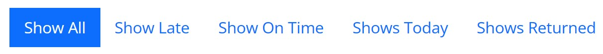

<!-- Improved compatibility of back to top link: See: https://github.com/othneildrew/Best-README-Template/pull/73 -->

<!--
*** Thanks for checking out the Best-README-Template. If you have a suggestion
*** that would make this better, please fork the repo and create a pull request
*** or simply open an issue with the tag "enhancement".
*** Don't forget to give the project a star!
*** Thanks again! Now go create something AMAZING! :D
-->

<!-- PROJECT SHIELDS -->
<!--
*** I'm using markdown "reference style" links for readability.
*** Reference links are enclosed in brackets [ ] instead of parentheses ( ).
*** See the bottom of this document for the declaration of the reference variables
*** for contributors-url, forks-url, etc. This is an optional, concise syntax you may use.
*** https://www.markdownguide.org/basic-syntax/#reference-style-links
-->

<!-- PROJECT LOGO -->
 

  
  <h1 align="center">LMS</h1>
  <h2>By Tal Rozman</h2>

<!-- TABLE OF CONTENTS -->

  
Table of Contents

  <ol>
    <li>
      <a href="#about-the-project">About The Project</a>
    </li>
    <li>
      <a href="#Built-With">Built with</a>
    </li>
    <li><a href="#contact">Contact</a></li>
  </ol>

<!-- ABOUT THE PROJECT -->
<h1>About The Project</h1>

LMS is a new web based library management system! 
The LMS is easy to use, accesible and can be operated on any computer/mobile device without any installation!
  
<h1>system abilities</h1>
<h2>Books management</h2>

<h3>List books</h3>
- Search book by name
 <h3>Add Book</h3>
  - Book's name 
  - Book's author 
  - Book's month and year of publish 
  - Book's type - how long can be loaned for (2/5/10 days) 
  <h3>Delete book</h3>
<h2>customers management</h2>

<h3>List customers</h3>
- Search customer by name
<h3>Add Customer</h3>
 - Customer's name 
 - Customer's city 
 - Customer's age 
<h3>Delete Customer</h3>
<h2>loans management</h2>

<h3>Display loans</h3>

 - Filter by late loans 
 - Filter by on time loans 
 - Filter by due today's loans 
 - Filter by closed loans (only loans with returned status) 
<h3>Open Loan</h3>
 - Customer's name 
 - Book's name 
 - Loan's date - retroactive is possible 
<h3>Close Loan</h3>
 - Return date - retroactive is possible 

(<a href="#readme-top">back to top</a>)

<h1>Built With</h1>
LMS is build with the following technologies and languages -   
<h3>BACK END</h3>
 - Python 
 - Flask 
 - SQLAlchemy 
<h3>FRONT END</h3>
 - HTML 
 - JavaScript 
 - CSS 
 

(<a href="#readme-top">back to top</a>)

<!-- CONTACT -->
<h1>Contact</h1>
Tal Rozman - talrozman9@outlook.com 
Project Link: https://github.com/TalRozman/Library_Project 

(<a href="#readme-top">back to top</a>)

